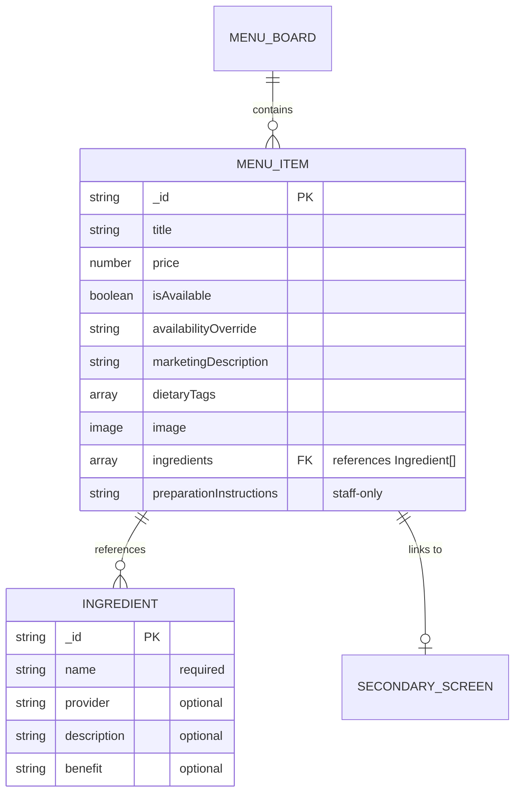

# feat: Extend Menu Items with Ingredients and Preparation Instructions

## Overview

Extend the White Rabbit Cafe Menu Sanity schema to support ingredients and preparation instructions for menu items. This enables better ingredient tracking, customer transparency about what's in their drinks/food, and internal prep documentation for staff.

## Problem Statement / Motivation

Currently, menu items lack ingredient information, making it difficult to:
- Show customers what's in their items (transparency, allergen awareness)
- Track ingredient sourcing and providers
- Document preparation instructions for staff consistency
- Highlight ingredient benefits (organic, locally sourced, etc.)

## Proposed Solution

1. **Create new `Ingredient` document type** with fields:
   - `name` (required) - Ingredient name
   - `provider` (optional) - Supplier/source
   - `description` (optional) - Brief description
   - `benefit` (optional) - Marketing benefit/feature

2. **Extend `MenuItem` schema** with:
   - `ingredients` - Array of references to Ingredient documents
   - `preparationInstructions` - Plain text field (staff-only, not customer-facing)

3. **Update player app** to display ingredients on:
   - Secondary screens only (full ingredient info with benefits)

## Technical Approach

### Schema Changes (Sanity Studio)

#### New File: `studio-cafe-menu/schemaTypes/ingredient.ts`

```typescript
import { defineField, defineType } from 'sanity'

export default defineType({
  name: 'ingredient',
  title: 'Ingredient',
  type: 'document',
  fields: [
    defineField({
      name: 'name',
      title: 'Ingredient Name',
      type: 'string',
      description: 'The name of the ingredient (e.g., "Oat Milk", "Espresso")',
      validation: (Rule) => Rule.required().min(2).max(100),
    }),
    defineField({
      name: 'provider',
      title: 'Provider / Supplier',
      type: 'string',
      description: 'Where this ingredient comes from (e.g., "Local Farm", "Oatly")',
    }),
    defineField({
      name: 'description',
      title: 'Description',
      type: 'text',
      rows: 2,
      description: 'Brief description of the ingredient',
      validation: (Rule) => Rule.max(300),
    }),
    defineField({
      name: 'benefit',
      title: 'Benefit / Feature',
      type: 'string',
      description: 'Key benefit or feature (e.g., "Rich in antioxidants", "Plant-based")',
      validation: (Rule) => Rule.max(100),
    }),
  ],
  preview: {
    select: {
      title: 'name',
      subtitle: 'provider',
    },
    prepare({ title, subtitle }) {
      return {
        title: title || 'Unnamed Ingredient',
        subtitle: subtitle || 'No provider specified',
      }
    },
  },
  orderings: [
    {
      title: 'Name A-Z',
      name: 'nameAsc',
      by: [{ field: 'name', direction: 'asc' }],
    },
  ],
})
```

#### Modify: `studio-cafe-menu/schemaTypes/menuItem.ts`

Add to the SANITY PRESENTATION FIELDS section (after `dietaryTags`):

```typescript
defineField({
  name: 'ingredients',
  title: 'Ingredients',
  type: 'array',
  of: [
    {
      type: 'reference',
      to: [{ type: 'ingredient' }],
    },
  ],
  description: 'Select ingredients used in this item. Drag to reorder by importance.',
}),
defineField({
  name: 'preparationInstructions',
  title: 'Preparation Instructions',
  type: 'text',
  rows: 5,
  description: 'Internal preparation instructions for staff (not shown to customers)',
}),
```

#### Modify: `studio-cafe-menu/schemaTypes/index.ts`

```typescript
import ingredient from './ingredient'
// ...existing imports...

export const schemaTypes = [
  menuItem,
  menuBoard,
  kioskSettings,
  menuModifier,
  secondaryScreen,
  ingredient,  // Add new type
]
```

#### Modify: `studio-cafe-menu/sanity.config.ts`

Add ingredient to the structure (in the `structure` function):

```typescript
S.documentTypeListItem('ingredient').title('Ingredients'),
```

### TypeScript Types (Player App)

#### Modify: `player/src/types/index.ts`

Add new interface:

```typescript
export interface Ingredient {
  _id: string
  name: string
  provider?: string
  description?: string
  benefit?: string
}
```

Update `MenuItem` interface:

```typescript
export interface MenuItem {
  // ...existing fields...
  ingredients?: Ingredient[]
  preparationInstructions?: string
}
```

### GROQ Queries

#### Modify: `player/src/lib/sanity.ts`

Update `ACTIVE_BOARD_QUERY` to include ingredients in the items expansion:

```groq
items[]-> {
  _id,
  title,
  price,
  isAvailable,
  availabilityOverride,
  marketingDescription,
  dietaryTags,
  image { asset-> { url } },
  linkedSecondaryScreen-> { /* existing fields */ },
  ingredients[]-> {
    _id,
    name,
    provider,
    description,
    benefit
  }
}
```

### Real-time Sync

#### Modify: `player/src/hooks/useMenuData.ts`

Update the listener query to include ingredients:

```typescript
const listenerQuery = '*[_type in ["kioskSettings", "menuBoard", "menuItem", "menuModifier", "secondaryScreen", "ingredient"]]'
```

### Player App Components

#### Modify: `player/src/components/SecondaryScreenLayout.tsx`

Add expanded ingredients section when displaying item details:

```tsx
{item.ingredients && item.ingredients.length > 0 && (
  <div className="ingredients-section mt-4">
    <h4 className="text-sm font-semibold mb-2">Ingredients</h4>
    <ul className="text-sm space-y-1">
      {item.ingredients.map(ing => (
        <li key={ing._id}>
          <span className="font-medium">{ing.name}</span>
          {ing.benefit && <span className="text-gray-400 ml-2">- {ing.benefit}</span>}
        </li>
      ))}
    </ul>
  </div>
)}
```

## Design Decisions

| Decision | Choice | Rationale |
|----------|--------|-----------|
| Ingredients as documents | Separate document type | Reusable across items, independent editing, single source of truth |
| Preparation instructions | Embedded text field | Specific to each item, no reuse needed, simpler |
| Deletion behavior | Block if referenced | Prevents broken references, protects data integrity |
| Prep instructions visibility | Staff-only | Internal operational detail, not customer-facing |
| Ingredient display location | Secondary screens only | Main menu stays clean, details available on demand |
| Ingredient ordering | Array order preserved | Allows prioritizing key ingredients first |

## Acceptance Criteria

### Functional Requirements

- [ ] New `Ingredient` document type is available in Sanity Studio
- [ ] Ingredients can be created with name (required), provider, description, and benefit (all optional except name)
- [ ] Menu items can reference multiple ingredients
- [ ] Ingredients can be reordered within a menu item (drag-and-drop)
- [ ] Preparation instructions field is available on menu items
- [ ] Deleting an ingredient used by menu items is blocked with an error message
- [ ] Ingredients display on secondary screens only (with full details and benefits)
- [ ] Real-time sync updates player app when ingredients are modified

### Non-Functional Requirements

- [ ] GROQ query remains performant with ingredient expansion
- [ ] Schema follows existing patterns (defineType, defineField)
- [ ] TypeScript types are updated and type-safe

## Files to Modify

| File | Action | Purpose |
|------|--------|---------|
| `studio-cafe-menu/schemaTypes/ingredient.ts` | CREATE | New ingredient document schema |
| `studio-cafe-menu/schemaTypes/menuItem.ts` | MODIFY | Add ingredients and preparationInstructions fields |
| `studio-cafe-menu/schemaTypes/index.ts` | MODIFY | Export ingredient schema |
| `studio-cafe-menu/sanity.config.ts` | MODIFY | Add ingredient to Studio structure |
| `player/src/types/index.ts` | MODIFY | Add Ingredient interface, update MenuItem |
| `player/src/lib/sanity.ts` | MODIFY | Update GROQ query to include ingredients |
| `player/src/hooks/useMenuData.ts` | MODIFY | Add ingredient to real-time listener |
| `player/src/components/SecondaryScreenLayout.tsx` | MODIFY | Display full ingredient details |

## Entity Relationship Diagram



## References

### Internal References
- Existing schema patterns: `studio-cafe-menu/schemaTypes/menuItem.ts`
- Reference example: `studio-cafe-menu/schemaTypes/menuBoard.ts:53` (items array)
- Type definitions: `player/src/types/index.ts`
- GROQ query: `player/src/lib/sanity.ts:10`
- Real-time listener: `player/src/hooks/useMenuData.ts:80`

### External References
- [Sanity Reference Type Docs](https://www.sanity.io/docs/reference-type)
- [Sanity Array Type Docs](https://www.sanity.io/docs/array-type)
- [Sanity Validation Docs](https://www.sanity.io/docs/validation)
