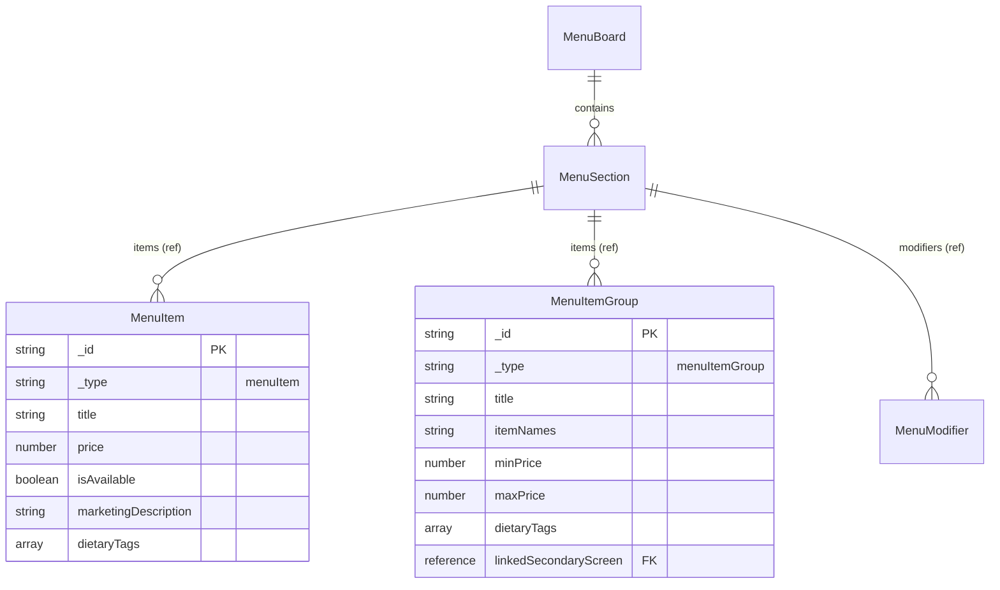

# feat: Add Menu Item Group with Price Range Display

## Overview

Add a new `menuItemGroup` schema type to the Sanity CMS that allows grouping POS products (like teas) that shouldn't be listed separately. Groups display:
- A title (e.g., "Teas", "Herbal Infusions")
- A price range instead of single price (e.g., "$3.75-$5.50")
- The names of underlying items where the description would normally appear

**Use Case:** The cafe has multiple tea varieties with different prices that should appear as one menu line item showing "Teas" with the price range, and listing "Earl Grey, English Breakfast, Chamomile, Green Tea" beneath.

## Problem Statement

Currently, every menu item displays individually with a single price. There's no way to:
1. Group related items that shouldn't appear separately (e.g., teas, sodas)
2. Show a price range for items with varying prices
3. Display a list of item names instead of a marketing description

## Proposed Solution

Create a new `menuItemGroup` document type that sits alongside `menuItem` in menu sections. This uses manual text entry for item names and manual price range entry (not references to existing menuItems) for simplicity and decoupling from Odoo sync.

### Design Decisions

| Decision | Choice | Rationale |
|----------|--------|-----------|
| Item source | Text field | Simpler than references; teas may not exist as separate Odoo-synced items |
| Price range | Manual entry | Decoupled from Odoo sync; editor has full control |
| Document type | Document (not inline) | Reusable across multiple boards if needed |
| Naming | `menuItemGroup` | Consistent with `menuItem` naming pattern |

## Technical Approach

### Files to Create

| File | Purpose |
|------|---------|
| `studio-cafe-menu/schemaTypes/menuItemGroup.ts` | New Sanity schema definition |

### Files to Modify

| File | Changes |
|------|---------|
| `studio-cafe-menu/schemaTypes/index.ts:1-10` | Export new schema type |
| `studio-cafe-menu/schemaTypes/menuBoard.ts:60` | Add menuItemGroup to section items reference types |
| `player/src/types/index.ts` | Add MenuItemGroup interface and update MenuSection.items union |
| `player/src/lib/sanity.ts` | Update GROQ query to handle polymorphic items |
| `player/src/components/CategoryColumn.tsx:41-43` | Dispatch to correct component based on _type |

### Files to Create (Frontend)

| File | Purpose |
|------|---------|
| `player/src/components/MenuItemGroup.tsx` | New component for rendering groups |

---

## Implementation Plan

### Phase 1: Sanity Schema

#### 1.1 Create menuItemGroup.ts

```typescript
// studio-cafe-menu/schemaTypes/menuItemGroup.ts
import { defineField, defineType } from 'sanity'

export default defineType({
  name: 'menuItemGroup',
  title: 'Menu Item Group',
  type: 'document',
  icon: () => '📦', // Visual indicator in Sanity Studio
  fields: [
    defineField({
      name: 'title',
      title: 'Group Title',
      type: 'string',
      description: 'Display name for the group (e.g., "Teas", "Herbal Infusions")',
      validation: (Rule) => Rule.required(),
    }),
    defineField({
      name: 'itemNames',
      title: 'Item Names',
      type: 'text',
      rows: 2,
      description: 'Comma-separated list of items in this group (e.g., "Earl Grey, English Breakfast, Chamomile, Green Tea")',
      validation: (Rule) => Rule.required(),
    }),
    defineField({
      name: 'priceRange',
      title: 'Price Range',
      type: 'object',
      description: 'Displayed as "$3.75-$5.50" on the menu',
      fields: [
        defineField({
          name: 'minPrice',
          title: 'Minimum Price',
          type: 'number',
          validation: (Rule) => Rule.required().min(0).precision(2),
        }),
        defineField({
          name: 'maxPrice',
          title: 'Maximum Price',
          type: 'number',
          validation: (Rule) => Rule.required().min(0).precision(2),
        }),
      ],
      validation: (Rule) =>
        Rule.custom((priceRange) => {
          if (!priceRange) return 'Price range is required'
          const { minPrice, maxPrice } = priceRange as { minPrice?: number; maxPrice?: number }
          if (minPrice !== undefined && maxPrice !== undefined && minPrice > maxPrice) {
            return 'Minimum price cannot be greater than maximum price'
          }
          return true
        }),
    }),
    defineField({
      name: 'dietaryTags',
      title: 'Dietary Tags',
      type: 'array',
      of: [{ type: 'string' }],
      description: 'Tags that apply to items in this group',
      options: {
        list: [
          { title: 'Vegan', value: 'VE' },
          { title: 'Vegetarian', value: 'V' },
          { title: 'Gluten Free', value: 'GF' },
          { title: 'Contains Nuts', value: 'N' },
          { title: 'Alcoholic', value: 'ALC' },
        ],
      },
    }),
    defineField({
      name: 'linkedSecondaryScreen',
      title: 'Linked Secondary Screen',
      type: 'reference',
      to: [{ type: 'secondaryScreen' }],
      description: 'Optional: A secondary screen with more details about this group',
    }),
  ],
  preview: {
    select: {
      title: 'title',
      itemNames: 'itemNames',
      minPrice: 'priceRange.minPrice',
      maxPrice: 'priceRange.maxPrice',
    },
    prepare({ title, itemNames, minPrice, maxPrice }) {
      const itemCount = itemNames ? itemNames.split(',').length : 0
      let priceDisplay = ''
      if (minPrice !== undefined && maxPrice !== undefined) {
        priceDisplay = minPrice === maxPrice
          ? `$${minPrice.toFixed(2)}`
          : `$${minPrice.toFixed(2)}-$${maxPrice.toFixed(2)}`
      }
      return {
        title: title || 'Untitled Group',
        subtitle: `${itemCount} items | ${priceDisplay}`,
      }
    },
  },
})
```

#### 1.2 Update index.ts

```typescript
// studio-cafe-menu/schemaTypes/index.ts
import menuItem from './menuItem'
import menuBoard from './menuBoard'
import menuItemGroup from './menuItemGroup'  // ADD
import kioskSettings from './kioskSettings'
import menuModifier from './menuModifier'
import secondaryScreen from './secondaryScreen'
import ingredient from './ingredient'

export const schemaTypes = [
  menuItem,
  menuBoard,
  menuItemGroup,  // ADD
  kioskSettings,
  menuModifier,
  secondaryScreen,
  ingredient,
]
```

#### 1.3 Update menuBoard.ts

Modify the `items` field in the sections array to accept both types:

```typescript
// studio-cafe-menu/schemaTypes/menuBoard.ts - around line 60
// Change from:
of: [{ type: 'reference', to: { type: 'menuItem' } }]

// To:
of: [
  {
    type: 'reference',
    to: [
      { type: 'menuItem' },
      { type: 'menuItemGroup' },
    ],
  },
]
```

---

### Phase 2: TypeScript Types

#### 2.1 Add MenuItemGroup interface

```typescript
// player/src/types/index.ts

export interface MenuItemGroup {
  _id: string
  _type: 'menuItemGroup'
  title: string
  itemNames: string
  priceRange: {
    minPrice: number
    maxPrice: number
  }
  dietaryTags?: DietaryTag[]
  linkedSecondaryScreen?: SecondaryScreenRef
}

// Update MenuItem to include _type for discrimination
export interface MenuItem {
  _id: string
  _type: 'menuItem'  // ADD this field
  title: string
  price: number
  isAvailable: boolean
  availabilityOverride?: AvailabilityOverride
  marketingDescription?: string
  dietaryTags?: DietaryTag[]
  image?: SanityImage
  linkedSecondaryScreen?: SecondaryScreenRef
  ingredients?: Ingredient[]
  preparationInstructions?: string
}

// Create union type for section items
export type MenuSectionItem = MenuItem | MenuItemGroup

// Update MenuSection
export interface MenuSection {
  heading: string
  metaCategory?: MetaCategory | null
  items?: MenuSectionItem[] | null  // CHANGE from MenuItem[]
  modifiers?: MenuModifier[] | null
  linkedSecondaryScreen?: SecondaryScreenRef
}
```

---

### Phase 3: GROQ Query Update

#### 3.1 Update ACTIVE_BOARD_QUERY

```groq
// player/src/lib/sanity.ts

// In the items projection, handle both types:
items[]->{
  _id,
  _type,
  title,
  // menuItem fields
  _type == 'menuItem' => {
    price,
    isAvailable,
    availabilityOverride,
    marketingDescription,
    dietaryTags,
    image,
    "linkedSecondaryScreen": linkedSecondaryScreen->{
      _id,
      title,
      keyboardShortcut,
      layout
    },
    "ingredients": ingredients[]->{
      _id,
      name,
      origin,
      image
    },
    preparationInstructions
  },
  // menuItemGroup fields
  _type == 'menuItemGroup' => {
    itemNames,
    priceRange,
    dietaryTags,
    "linkedSecondaryScreen": linkedSecondaryScreen->{
      _id,
      title,
      keyboardShortcut,
      layout
    }
  }
}
```

---

### Phase 4: Frontend Components

#### 4.1 Create MenuItemGroup.tsx

```tsx
// player/src/components/MenuItemGroup.tsx
import type { MenuItemGroup as MenuItemGroupType } from '../types'

interface MenuItemGroupProps {
  item: MenuItemGroupType
}

export function MenuItemGroup({ item }: MenuItemGroupProps) {
  const { title, itemNames, priceRange, dietaryTags } = item

  // Format price range
  const priceDisplay = priceRange.minPrice === priceRange.maxPrice
    ? `$${priceRange.minPrice.toFixed(2)}`
    : `$${priceRange.minPrice.toFixed(2)}-$${priceRange.maxPrice.toFixed(2)}`

  return (
    <div
      style={{
        display: 'grid',
        gridTemplateColumns: '1fr auto',
        gap: '2vw',
        padding: '0.8vh 0',
      }}
    >
      {/* Left column: Title and item names */}
      <div>
        <div
          style={{
            fontSize: '1.6vw',
            fontWeight: '500',
            color: '#ffffff',
            display: 'flex',
            alignItems: 'center',
            gap: '0.5vw',
          }}
        >
          {title}
          {dietaryTags && dietaryTags.length > 0 && (
            <span style={{ fontSize: '1.2vw', color: '#a8ff70' }}>
              {dietaryTags.join(' ')}
            </span>
          )}
        </div>
        {/* Item names displayed where description would be */}
        <div
          style={{
            fontSize: '1.3vw',
            color: '#ffffff',
            fontWeight: '300',
            marginTop: '0.3vh',
          }}
        >
          {itemNames}
        </div>
      </div>

      {/* Right column: Price range */}
      <div
        style={{
          fontSize: '1.6vw',
          fontWeight: '500',
          color: '#7ed957',
          whiteSpace: 'nowrap',
        }}
      >
        {priceDisplay}
      </div>
    </div>
  )
}
```

#### 4.2 Update CategoryColumn.tsx

```tsx
// player/src/components/CategoryColumn.tsx

import { MenuItem } from './MenuItem'
import { MenuItemGroup } from './MenuItemGroup'
import type { MenuSectionItem } from '../types'

// In the items map (around line 41-43):
{safeItems.map((item: MenuSectionItem) => {
  if (item._type === 'menuItemGroup') {
    return <MenuItemGroup key={item._id} item={item} />
  }
  return (
    <MenuItem
      key={item._id}
      item={item}
      ignoreStockLevels={ignoreStockLevels}
    />
  )
})}
```

---

## Acceptance Criteria

### Functional Requirements

- [ ] Content editors can create Menu Item Group documents in Sanity Studio
- [ ] Groups appear in section item picker alongside regular menu items
- [ ] Groups display with title, price range, and item names on the menu
- [ ] Price range displays as "$X.XX-$Y.YY" format (or single price if equal)
- [ ] Item names appear where marketingDescription would appear for regular items
- [ ] Dietary tags display next to title (same as regular items)
- [ ] Groups can be reordered within sections via drag-and-drop

### Non-Functional Requirements

- [ ] Schema validates that minPrice <= maxPrice
- [ ] Preview in Sanity shows item count and price range
- [ ] TypeScript types are correct and discriminated by `_type`
- [ ] No console errors or type errors in frontend

### Edge Cases

- [ ] Single price (minPrice === maxPrice) displays as "$X.XX" not "$X.XX-$X.XX"
- [ ] Long item names wrap naturally without breaking layout
- [ ] Empty itemNames field prevented by validation

---

## Entity Relationship Diagram



---

## Testing Plan

1. **Schema Validation**
   - Create group with valid data → should save
   - Create group with minPrice > maxPrice → should show validation error
   - Create group with empty title → should show validation error
   - Create group with empty itemNames → should show validation error

2. **Display Testing**
   - Add group to section → should appear in menu
   - Group with range ($3.75-$5.50) → should show range format
   - Group with equal prices → should show single price
   - Group with dietary tags → should display tags

3. **Integration Testing**
   - Mix groups and regular items in same section
   - Real-time updates when group is edited in Sanity

---

## References

### Internal Files

- Schema patterns: `studio-cafe-menu/schemaTypes/menuItem.ts`
- Current GROQ query: `player/src/lib/sanity.ts:1-50`
- MenuItem component: `player/src/components/MenuItem.tsx`
- CategoryColumn: `player/src/components/CategoryColumn.tsx:41-43`
- Types: `player/src/types/index.ts`

### External Documentation

- [Sanity Schema Types](https://www.sanity.io/docs/schema-types)
- [Sanity Array Type](https://www.sanity.io/docs/array-type)
- [Sanity Object Type](https://www.sanity.io/docs/object-type)
- [GROQ Conditional Projections](https://www.sanity.io/docs/how-queries-work#conditional-projection)

---

🤖 Generated with [Claude Code](https://claude.com/claude-code)
